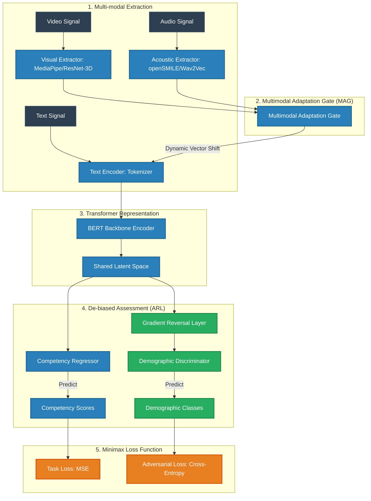

# MAG-BERT-ARL for Fair Automated Video Interview Assessment

Evaluating automated video interviews (AVIs) using a robust, multi-modal artificial intelligence framework that actively mitigates systemic demographic bias.

---

## 📌 Project Overview

Traditional hiring processes are often slow, subjective, and prone to conscious or unconscious human biases. While Automated Video Interview (AVI) systems offer a scalable solution, standard machine learning approaches risk learning and reinforcing existing societal inequalities (such as those related to gender, age, or ethnicity) present in historical hiring data.

**MAG-BERT-ARL** is a state-of-the-art, research-inspired framework designed to provide **fair, reliable, and multi-modal assessment** of video-based interviews. By integrating lexical, acoustic, and visual modalities, the model gains a holistic understanding of a candidate's communication style and competencies. Simultaneously, a built-in **Adversarial Representation Learning (ARL)** framework actively sanitizes these representations of sensitive demographic information—ensuring the final competency scores are predictive of job performance, not candidate demographics.

---

## ⚡ Key Modalities & Features

The framework analyzes candidate responses across three primary modalities:

*   **Verbal Modality (Text):** Processes candidate transcripts using bidirectional language modeling to evaluate response relevance, vocabulary complexity, structure, and professional domain knowledge.
*   **Vocal Modality (Audio):** Extracts acoustic and prosodic features (e.g., pitch, energy, vocal jitter, speaking rate, pauses) to assess communication attributes such as confidence, pacing, and emotional tone.
*   **Visual Modality (Video):** Analyzes facial expressions, action units, micro-expressions, posture, and gaze tracking to capture non-verbal cues related to engagement and presentation.
*   **Fairness-Aware De-biasing:** Combines adversarial training with fairness constraints to explicitly minimize predictive disparities across diverse demographic subgroups.

---

## 🔬 System Architecture

The core of this project is the **MAG-BERT-ARL** architecture. It integrates a **Multimodal Adaptation Gate (MAG)** with a **BERT** backbone, coupled with an **Adversarial Representation Learning (ARL)** head for bias mitigation.

### Conceptual Architecture Diagram

```
                       [ Input Modalities ]
                                |
       +------------------------+------------------------+
       |                        |                        |
   [ Video ]                [ Audio ]                 [ Text ]
       |                        |                        |
[ Visual Extractor ]    [ Acoustic Extractor ]     [ Tokenizer ]
(MediaPipe/ResNet-3D)    (openSMILE/Wav2Vec)      (BERT Wordpiece)
       |                        |                        |
       v                        v                        |
[ Visual Embeddings ]   [ Acoustic Embeddings ]          |
       |                        |                        |
       +-----------+------------+                        |
                   |                                     |
                   v                                     v
       +-----------------------+                         |
       | Multimodal Adaptation |                         |
       |      Gate (MAG)       |                         |
       +-----------+-----------+                         |
                   | (Shifts)                            |
                   +------------------------> (+) <------+ (Inject)
                                             |
                                             v
                                   [ Joint Word Embeddings ]
                                             |
                                             v
                                   [ BERT Transformer ]
                                             |
                                             v
                              [ Pooler / Target Competency ]
                                             |
                                             v
                              [ Multimodal Latent Space ]
                                             |
                         +-------------------+-------------------+
                         |                                       |
                         v                                       v
               [ Competency Regressor ]               [ Gradient Reversal Layer ]
                         |                                       | (Reverses Gradients)
                         v                                       v
             [ Fair Competency Scores ]            [ Demographic Discriminator ]
                                                                 |
                                                                 v
                                                     [ Demographics Prediction ]
                                                    (Minimizes prediction accuracy)
```

### Architectural Deep-Dive

1.  **Multimodal Adaptation Gate (MAG):** 
    Instead of performing simple late-stage concatenation of features, MAG maps acoustic ($x_a$) and visual ($x_v$) features to the text embedding space. It calculates a dynamic shift vector $H_m$:
    $$H_m = g(x_a, x_v) \cdot W_m$$
    This shift vector is directly added to the text embeddings prior to the BERT encoder layers, allowing the attention heads to dynamically weight verbal arguments based on facial expressions and tone of voice.

2.  **Adversarial Representation Learning (ARL) for Fairness:**
    To guarantee fairness, the model forces the BERT encoder to learn representations that are uninformative of sensitive characteristics (e.g., gender, ethnicity, age).
    *   **The Competency Regressor** attempts to minimize mean-squared error on interview ratings.
    *   **The Demographic Discriminator** tries to classify sensitive candidate attributes from the same shared latent space.
    *   **The Gradient Reversal Layer (GRL)** sits between the latent representation and the discriminator. During backpropagation, it multiplies the gradients from the discriminator by a negative constant ($-\lambda$), driving the encoder to actively strip away demographic indicators.



---

## 🛠️ Tech Stack

*   **Deep Learning Platform:** PyTorch, PyTorch Lightning
*   **Natural Language Processing:** Hugging Face Transformers (BERT, RoBERTa)
*   **Audio Signal Processing:** openSMILE, Librosa, Wav2Vec 2.0
*   **Computer Vision:** MediaPipe, OpenCV, ResNet-3D
*   **API & Backend Service:** FastAPI, Pydantic, Uvicorn
*   **Data Pipelines & Analysis:** NumPy, Pandas, Scikit-learn, SciPy
*   **Fairness Auditing:** Fairlearn, AIF360

---

## 📁 Repository Structure

Below is the layout of the project, structured for scalability, clean separation of concerns, and ease of deployment:

```directory
.
├── configs/                  # Configuration profiles (YAML) for training and pipelines
│   ├── model_config.yaml     # Model hyperparameter settings (GRL lambda, hidden dimensions)
│   └── preprocess_config.yaml# Modality extraction configuration thresholds and sample rates
├── datasets/                 # Custom PyTorch Dataset implementations
│   ├── __init__.py
│   ├── multimodal_dataset.py # Laser-aligned text, audio, and visual pipeline generator
│   └── sampler.py            # Balanced batch sampler to prevent group skew
├── models/                   # MAG-BERT-ARL model definitions
│   ├── __init__.py
│   ├── layers.py             # Custom layers (Multimodal Adaptation Gate, GRL layer)
│   ├── model.py              # Main MAG-BERT-ARL network definition
│   └── loss.py               # Combined minimax and fairness-constrained loss functions
├── notebooks/                # Experimental analysis and validation
│   ├── 01_eda_multimodal.ipynb# Exploration of feature alignments across modalities
│   └── 02_fairness_audit.ipynb# Visualization of demographic clusters and distribution plots
├── preprocessing/            # Pipeline modules to ingest raw video files
│   ├── __init__.py
│   ├── face_processor.py     # OpenCV and MediaPipe facial marker extraction
│   ├── audio_processor.py    # Librosa spectrogram and openSMILE prosody parser
│   └── text_aligner.py       # Forced aligner matching speech segments with transcripts
├── scripts/                  # Utility and operational automation scripts
│   ├── train.py              # Training execution loop and tensor logging
│   └── evaluate_fairness.py  # Disparate impact and correlation metric calculation
├── tests/                    # Robust test suites
│   ├── test_layers.py        # Unit tests verifying MAG shifts and GRL gradient negation
│   └── test_preprocess.py    # Edge-case checks for broken files or missing modalities
├── .gitignore                # Environment exclusions, weight files, and temporary caches
├── .python-version           # Target development environment version specifier
└── README.md                 # Project description and implementation guide
```

---

## ⚙️ Setup & Installation

*This setup guide serves as a placeholder for deployment in local or production development environments.*

### Prerequisites

Ensure you have Python 3.10+ and the necessary system tools installed for multimedia processing:
*   **FFmpeg:** Required for splitting audio and video streams.
*   **GCC / Build Tools:** Required for compiling some C-based audio libraries (like `openSMILE`).

### Step-by-Step Installation

1.  **Clone the Repository:**
    ```bash
    git clone https://github.com/username/MAG-BERT-ARL.git
    cd MAG-BERT-ARL
    ```

2.  **Create and Activate a Virtual Environment:**
    ```bash
    # Using python venv
    python -m venv .venv
    
    # On Windows:
    .venv\Scripts\activate
    # On macOS/Linux:
    source .venv/bin/activate
    ```

3.  **Install Required Packages:**
    ```bash
    pip install --upgrade pip
    pip install -r requirements.txt
    ```

4.  **Verify Modality Toolkits:**
    Ensure FFmpeg is correctly mapped and accessible by the environment:
    ```bash
    ffmpeg -version
    ```

---

## 📊 Evaluation & Fairness Metrics

To validate model predictions without relying on artificial metrics, the framework is designed to report performance across two complementary dimensions:

### 1. Competency Assessment Performance
*   **Mean Squared Error (MSE):** Measures the distance between automated competency scores and ground-truth expert annotations.
*   **Pearson & Spearman Rank Correlation ($\rho$ / $r_s$):** Evaluates how accurately the system ranks candidates relative to human evaluator alignments.

### 2. Algorithmic Fairness Audits
*   **Demographic Parity Difference:** Checks if the probability of a candidate receiving high ratings is identical across protected classes (e.g., gender):
    $$|P(\hat{Y} \ge \tau \mid A = 0) - P(\hat{Y} \ge \tau \mid A = 1)| \le \epsilon$$
*   **Equal Opportunity Difference:** Evaluates if the true positive rate is consistent across groups, ensuring highly-qualified candidates are graded fairly regardless of demographic.
*   **Mutual Information (MI):** Quantifies residual sensitive demographic attributes remaining in the latent embeddings ($I(MLS; A) \to 0$).

---

## 🗺️ Roadmap & Milestones

The project is structured across five sequential implementation phases:

*   [x] **Phase 1: Project Structuring & Foundations**
    *   Set up modular folder structure and build configuration systems.
    *   Select target base models and establish schema files for multi-modal features.
*   [ ] **Phase 2: Ingestion & Feature Preprocessing Pipelines**
    *   Develop visual pipeline extraction (MediaPipe coordinates).
    *   Implement acoustic analyzer (pitch, tone, energy extraction).
    *   Set up speech-to-text diarization and transcript word-mapping.
*   [ ] **Phase 3: MAG-BERT Fusion Model Development**
    *   Implement custom Multimodal Adaptation Gate layer in PyTorch.
    *   Set up the combined model to accept gated inputs within BERT attention layers.
*   [ ] **Phase 4: Adversarial Fairness Implementation**
    *   Write the Gradient Reversal Layer (GRL).
    *   Build the secondary demographic classifier head.
    *   Develop the multi-task loss optimizer combining target accuracy and adversarial penalties.
*   [ ] **Phase 5: Auditing, APIs & Production Validation**
    *   Perform multi-dimensional audits to track and eliminate performance divergence across cohorts.
    *   Build a FastAPI wrapper to accept raw mp4 uploads and output fair evaluation reports.
